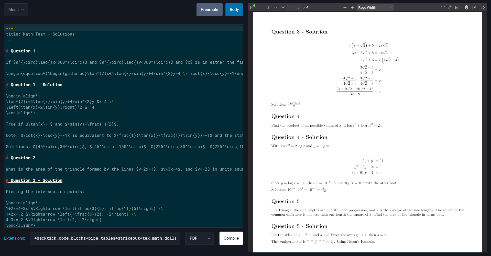

# mdTeX

<p align="center">
    
</p>

A markdown/LaTeX editor that compiles PDFs via Pandoc.

Requires both [pandoc](https://pandoc.org/) and [texlive](https://www.tug.org/texlive/) to be installed.

Built with [Tauri](https://v2.tauri.app/) and [Vite](https://vite.dev/). Code editor powered by [Codemirror](https://codemirror.net/).

## Features



- Markdown language highlighting for body, LaTeX for preamble
- [Pandoc extensions](https://pandoc.org/MANUAL.html#pandocs-markdown) for converting from Markdown
- Save default preamble, body, and extensions
- Convert to PDF normally or via beamer
- Save PDF to the same folder as the Markdown file and embeds the PDF

## Behind the Scenes

The app creates a temporary .yaml file with `header-includes:` to add LaTeX preamble, then runs the following pandoc command:

```js
pandoc --from markdown${extensions} --to ${format} --output ${pdf} ${yaml} ${markdown}
```